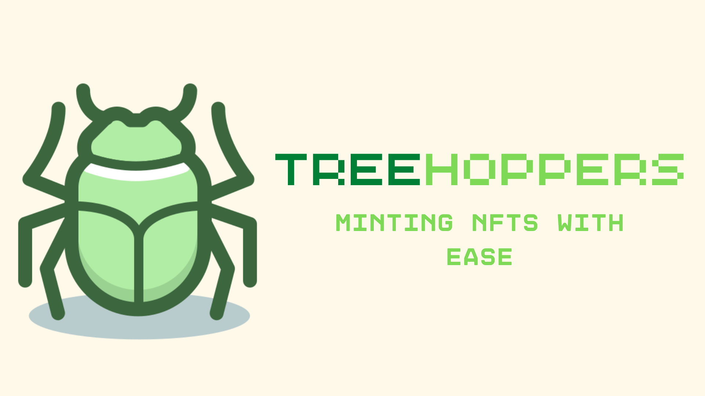
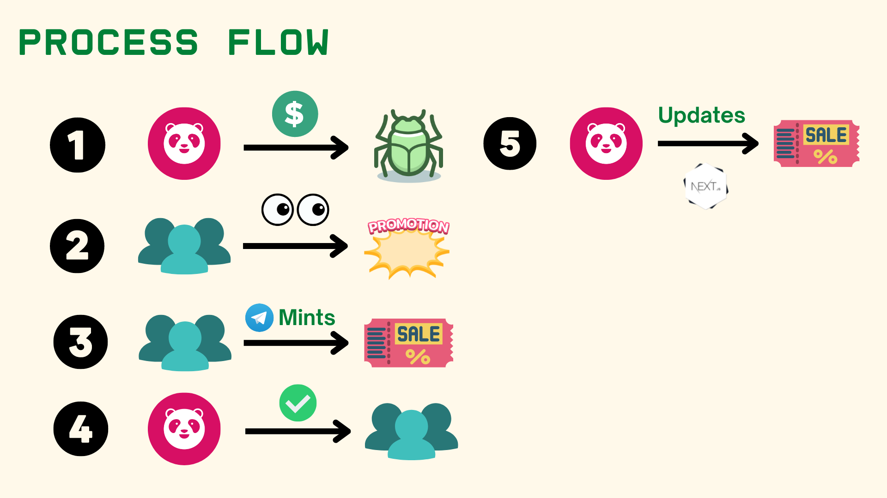
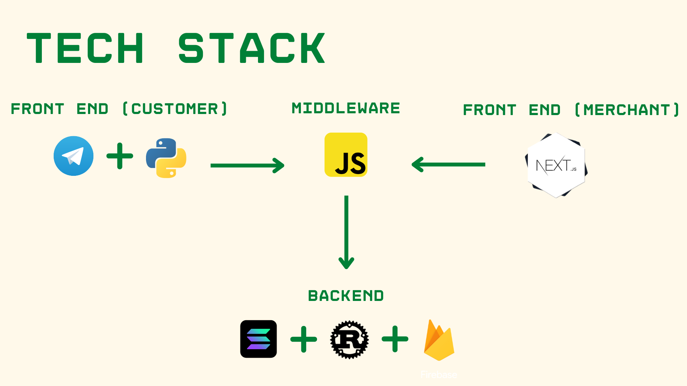

# Treehoppers
Our project aims to help Merchants with customer acquisition through the creation of a telegram bot that enables customers to claim coupons directly on the blockchain (Solana). Our project Consists of two parts: 

<ul>
<li>A telegram bot that allows customers to interacts directly on the Solana blockchain as seen in this repo</li>
<li>A merchant facing application, allowing them to create new coupon collections which can be found at https://github.com/crustyapples/treehoppers-merchant!</li>
</ul>

For a better understanding of the project, do check out our pitch deck [here](https://www.canva.com/design/DAFXJE3KDho/jDnSqSJxUaFqxMSJB15D1g/view?utm_content=DAFXJE3KDho&utm_campaign=designshare&utm_medium=link&utm_source=publishsharelink) and the demo of our application on [Youtube](https://www.youtube.com/watch?v=EzBdCXiMzFM)!

# Table of Contents
- [Problem and Solution](##problem-and-solution)
- [Benefits](##benefits)
- [Process Flow](##process-flow)
- [Technical Stack](##technical-stack)
- [Overview and Installation](##overview-and-installation)
- [BUILDERS](##builders)

## Problem and Solution
So first of all, what problem are we trying to address? Well how do retailers, particularly small and medium business, try to increase retention and acquisition.

They use <b>coupons</b>! However there are several issues with coupons as it stands.

1. Physical coupons are a hassle for customers and are often left unclaimed, wasting resources. Depending on the size of the physical coupon it could be anywhere between $0.30 and $2.50.
2. Digital coupons although they provide more flexibility, leave retailers at the mercy of platform providers. For platform providers like Mezzofy they typically charge a Flat Rate of US$0.40 Per Coupon.

As such, our solution is a telegram bot that enables customers to claim coupons on the blockchain directly.

## Benefits
Here are some of the benefits of our solution:

1. Telegram has a simple and familiar user interface as compared to other digital coupon applications.
2. Telegram has an active base of 55.2 million users, allowing for retailers to reach out to more customers
3. It also provides a cheaper alternative since retailers would not need to pay platform fees

Why Blockchain?

1. Coupons would be easy to verify and fraud proof, NFTs can't be faked.
2. There is also better data analytics on customer behavior i.e - who used the coupon, how many do they own among other metrics.

## Process Flow

## Technical Stack

## Overview and Installation

1. Seamless Minting of NFT
2. Custodial wallet Holding your Nft for max convenience
3. Instant mint and confirmation

### Set Up

1. git clone
2. Install dependencies\
    pip install python-telegram-bot --pre\
    pip install python-dotenv\
    pip install requests
2. solana config set --url devnet
3. anchor test

### Environment Variables
1. Telebot API Key
2. Pinata JWT Key

### Tech Stack
Our bot uses the python-telegram-bot library for the telegram bot, ExpressJS as middleware to process user inputs, and Solana Web3js to interact with our Rust-based Contract

### Deployment
- Contract deployed to [BgAh9RE8D5119VA1q28MxPMx77mdbYxWc7DPB5ULAB5x](https://solana.fm/address/BgAh9RE8D5119VA1q28MxPMx77mdbYxWc7DPB5ULAB5x) (Devnet)

## Builders
